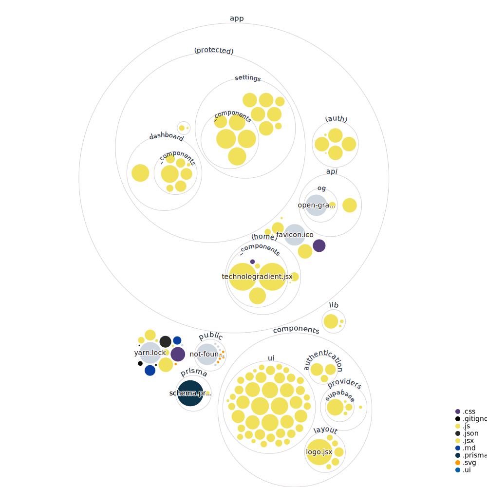

# Kazooo Starter Project Template
This template provides a solid foundation for your web application using popular packages such as Prisma, Radix UI, Supabase, Lucide React, Next.js 13, SWR, and Yup. With built-in authentication using Supabase and seamless integration with a Supabase database, you can jumpstart your development process and focus on building your app's unique features.

## Thanks to [shadcn/ui](https://ui.shadcn.com) for his Re-usable ui components  

The Starter Project Template is designed to help you quickly get started with your web application development. This template incorporates various packages and tools to provide a solid foundation for your project.

## Features
- **Next.js 13**: The latest version of Next.js, a popular React framework for building server-rendered and statically generated websites.
- **Fonts** with `next/font`
- **Icons** from [Lucide](https://lucide.dev)
- **Dark mode** with `next-themes`
- **Tailwind CSS** class sorting, merging and linting.
- **Prisma**: A powerful ORM (Object-Relational Mapping) tool for database management and query generation.
- **Radix UI**: A comprehensive UI toolkit with a wide range of customizable components to enhance your app's user interface.
- **Supabase**: An open-source Firebase alternative that offers a fully featured backend-as-a-service (BaaS) solution, including authentication and database services.
- **SWR**: A lightweight React Hooks library for remote data fetching, caching, and synchronization.
- **Yup**: A JavaScript object schema validation library to ensure data integrity and validate user inputs.

## Visual

## Usage

1. Clone or download the Starter Project Template repository.
2. Install the required dependencies by running `npm install` or `yarn install`.
3. Customize the template to fit your project requirements.
4. Start the development server with `npm run dev` or `yarn dev`.
## Note 
- Be sure to remove unnecessary dependencies from package.json before you start installing the project

For more detailed documentation and usage examples, refer to the [official documentation](https://example.com).

## License

Licensed under the [MIT license](https://example.com).

